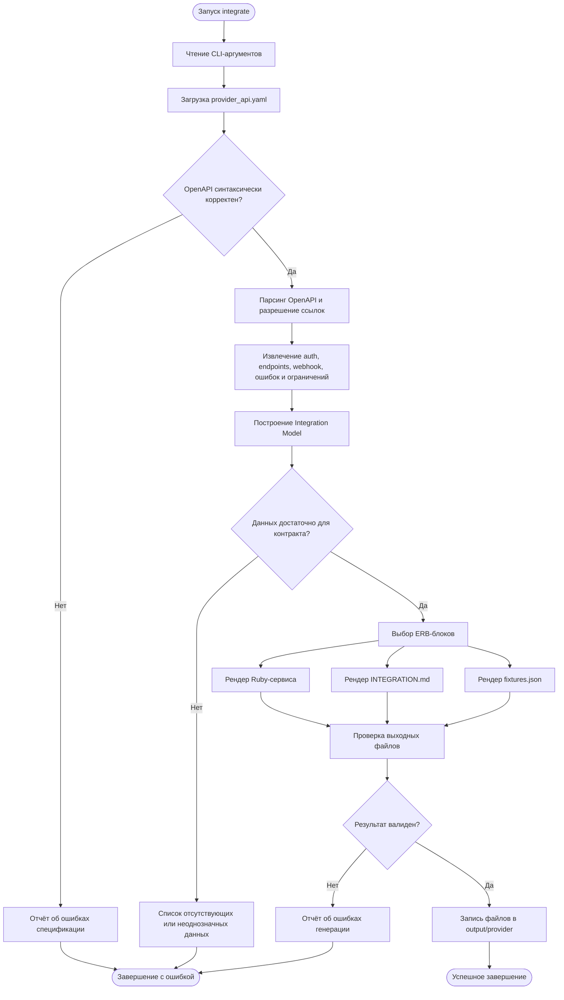

# План действий генератора

Этот документ описывает поведение готового инструмента при одном запуске CLI.



## Результат запуска

```text
output/<provider>/
├── <provider>_service.rb
├── INTEGRATION.md
└── fixtures.json
```

Генератор должен завершаться с ненулевым кодом, если входной OpenAPI нельзя
прочитать, промежуточная модель не удовлетворяет контракту или выходные файлы
не проходят проверку.
