# План разработки

Диаграмма показывает зависимости между компонентами. 

```mermaid
flowchart LR
    foundation["0. Структура проекта<br/>и ERB-каталоги"]
    model["1. Integration Model<br/>единый контракт данных"]
    parser["2. OpenAPI Parser<br/>YAML и refs"]
    extractors["3. Extractors<br/>правила и эвристики"]
    renderer["4. ERB Renderer<br/>контекст и partials"]
    blocks["5. Ruby-блоки<br/>NovaPay vertical slice"]
    generators["6. Generators<br/>service, docs, fixtures"]
    cli["7. CLI<br/>валидация и вывод"]
    tests["8. Tests<br/>unit и end-to-end"]
    release["9. Готовый MVP<br/>демо NovaPay"]

    foundation --> model
    model --> parser
    parser --> extractors
    model --> renderer
    renderer --> blocks
    extractors --> generators
    blocks --> generators
    generators --> cli
    generators --> tests
    cli --> tests
    tests --> release

    classDef done fill:#d1fae5,stroke:#047857,color:#064e3b
    classDef next fill:#fef3c7,stroke:#d97706,color:#78350f
    classDef pending fill:#f3f4f6,stroke:#6b7280,color:#111827

    class foundation done
    class model next
    class parser,extractors,renderer,blocks,generators,cli,tests,release pending
```

## Этапы

- [x] Подготовить каталоги слоёв и ERB-шаблонов.
- [ ] Описать `Integration` и вложенные value objects.
- [ ] Реализовать чтение OpenAPI и локальных `$ref`.
- [ ] Извлечь данные NovaPay в промежуточную модель.
- [ ] Реализовать ERB renderer и подключение partial-блоков.
- [ ] Добавить блоки `create_request`, `fetch_status`, callback и mappings.
- [ ] Собрать генераторы сервиса, документации и фикстур.
- [ ] Подключить CLI и понятные сообщения об ошибках.
- [ ] Покрыть слои unit-тестами и добавить end-to-end fixture.
- [ ] Проверить полный сценарий на `config/provider_api.yaml`.

## Критерий готовности MVP

Одна CLI-команда читает тестовый OpenAPI и детерминированно создаёт три валидных
артефакта. Повторный запуск с тем же входом не меняет результат, а неподдержанные
или неоднозначные части спецификации выводятся как явные ошибки или warnings.
