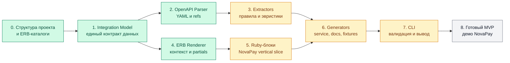

# План разработки

Диаграмма показывает зависимости между компонентами. 

## Текущий этап

Минимальный путь от CLI до Ruby-файла работает. Он предназначен для проверки
границ слоёв и пока генерирует сервис с методами-заготовками.

## Этапы

- [x] Подготовить каталоги слоёв и ERB-шаблонов.
- [x] Описать `Integration` и вложенные value objects.
- [x] Реализовать классы `Integration Model`.
- [ ] Реализовать проверку инвариантов модели.
- [x] Подключить `openapi3_parser` через собственный parser adapter.
- [x] Извлечь provider metadata и authentication в промежуточную модель.
- [ ] Извлечь данные NovaPay в промежуточную модель.
- [x] Реализовать базовый ERB renderer и подключение partial-блоков.
- [ ] Добавить блоки `create_request`, `fetch_status`, callback и mappings.
- [x] Собрать минимальный generator Ruby-сервиса.
- [ ] Собрать генераторы сервиса, документации и фикстур.
- [x] Подключить минимальный CLI с `--spec`, `--output` и кодами завершения.
- [ ] Добавить проверку полноты модели и подробные diagnostics в CLI.
- [ ] Проверить полный сценарий на `config/provider_api.yaml`.

## Критерий готовности MVP

Одна CLI-команда читает тестовый OpenAPI и детерминированно создаёт три валидных
артефакта. Повторный запуск с тем же входом не меняет результат, а неподдержанные
или неоднозначные части спецификации выводятся как явные ошибки или warnings.
